<div align="center">

# LZT Control

**Локальная панель для работы с объявлениями, покупками и LZT API**

<p>
  
  
  
  
  
</p>

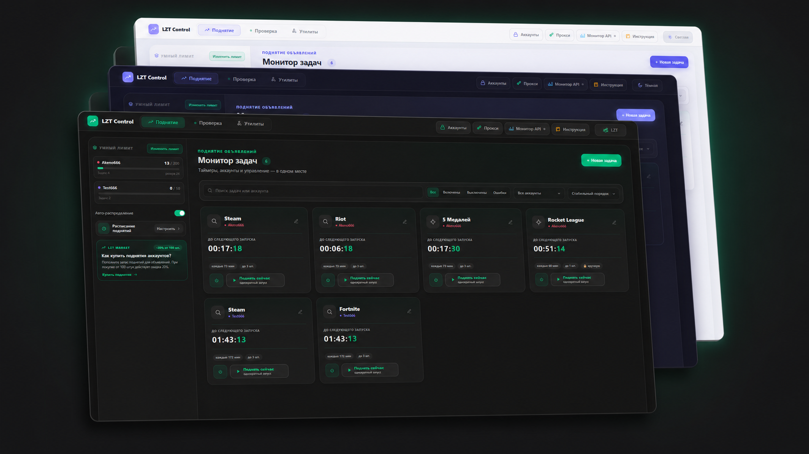

</div>

> [!NOTE]
> LZT Control — неофициальный open-source проект сообщества. Он не связан с командой Lolzteam или LZT Market.

LZT Control рассчитан на продавцов и реселлеров, которым нужно держать в одном месте поднятие объявлений, проверку покупок, публикацию после гарантии и аналитику. Программа запускается на компьютере пользователя и открывается в обычном браузере.

## Возможности

| Раздел | Что находится внутри |
|---|---|
| **Поднятие** | Задачи по ссылкам и отдельным ID, ручной запуск, расписание, прокси и личные лимиты нескольких аккаунтов |
| **Проверка** | Опрос покупок, проверки во время гарантии на валид, проверки КТ, арбитражи, история операций, пролив аккаунтов |
| **Публикация** | Ручная и автоматическая публикация после гарантии, повторы временных ошибок и уведомления в Telegram |
| **Аналитика** | История покупок и перепродаж, прибыль, убытки, непроданные аккаунты и предложения скупщиков |
| **Утилиты** | Проверка Steam на КТ, массовые метки, поиск продавцов и создание арбитражей |
| **Монитор API** | Журнал запросов, расход лимитов, HTTP-статусы и ответы сервера |

## Поднятие объявлений

Для каждого LZT-аккаунта задаётся свой суточный лимит. Авто-распределение учитывает активные задачи и оставляет резерв для задач с зафиксированным интервалом. Задачи можно запускать по фильтру или по списку отдельных объявлений.

<p align="center">
  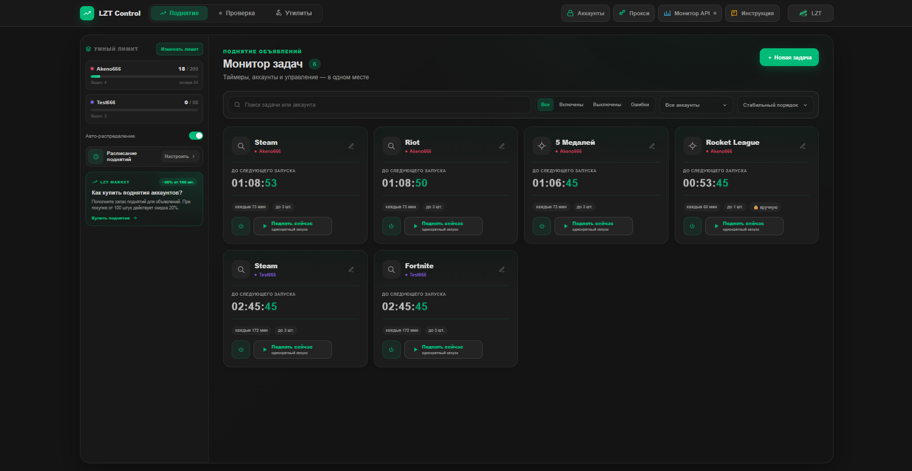
</p>

На карточке видны владелец задачи, интервал, количество объявлений за запуск и время до следующего поднятия. Задачу можно остановить, запустить один раз или отредактировать.

## Проверка покупок

Программа опрашивает историю покупок и ставит проверки на выбранных этапах гарантии. Для каждого аккаунта видны этап, время запуска и результат. Счётчики и очередь обновляются без перезагрузки страницы.

<p align="center">
  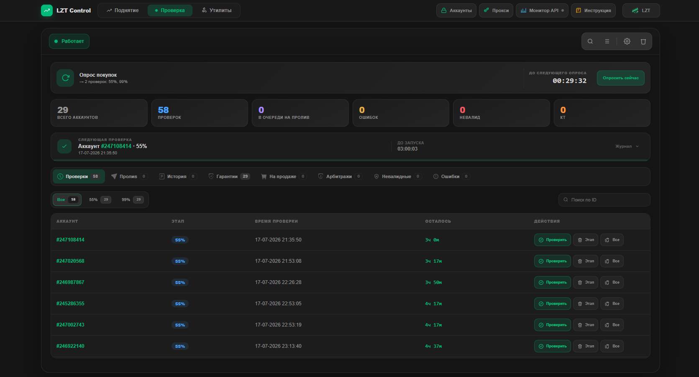
</p>

Результаты разнесены по отдельным вкладкам: история, гарантии, опубликованные аккаунты, арбитражи, невалидные аккаунты и технические ошибки.

### Журнал выполнения

Журнал раскрывается прямо под строкой текущей проверки. В нём видно начало операции, ответ сервера, результат проверки и последующее действие.

<p align="center">
  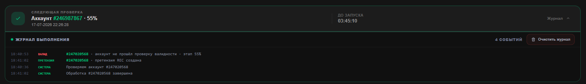
</p>

## Утилиты

Утилиты запускаются отдельно друг от друга. У каждой свой экран, настройки, ход выполнения и сохранённый результат.

<p align="center">
  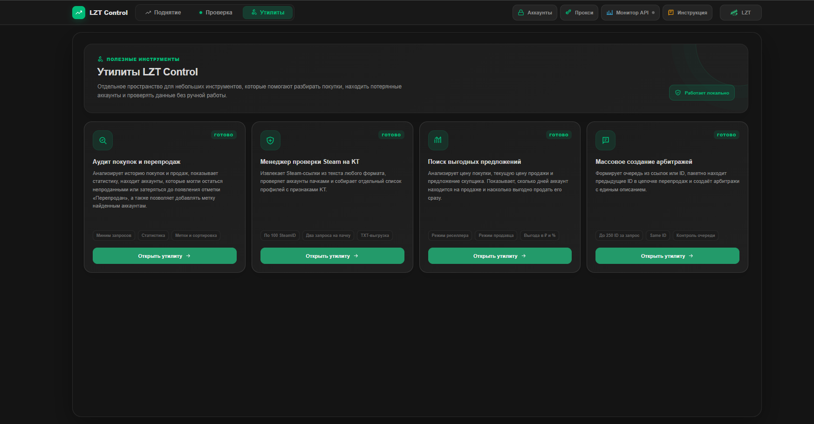
</p>

| Утилита | Для чего нужна |
|---|---|
| **Аудит покупок и перепродаж** | Ищет цепочки перепродаж и аккаунты, которые могли потеряться в старой истории покупок |
| **Менеджер проверки Steam на КТ** | Проверяет Steam аккаунты, проверяет наличие КТ, удобно отображает списки КТ и продавцов |
| **Поиск выгодных предложений** | Сравнивает цену покупки, текущую цену продажи и предложение скупщика |
| **Массовое создание арбитражей** | Готовит и создает арбитражи с кастомным описанием по ссылкам или ID аккаунтов |

### Аудит покупок и перепродаж

Одна страница покупок обрабатывается одним запросом. Во время поиска видны текущая страница, прогресс и журнал. Результат сохраняется локально и открывается отдельной таблицей.

<p align="center">
  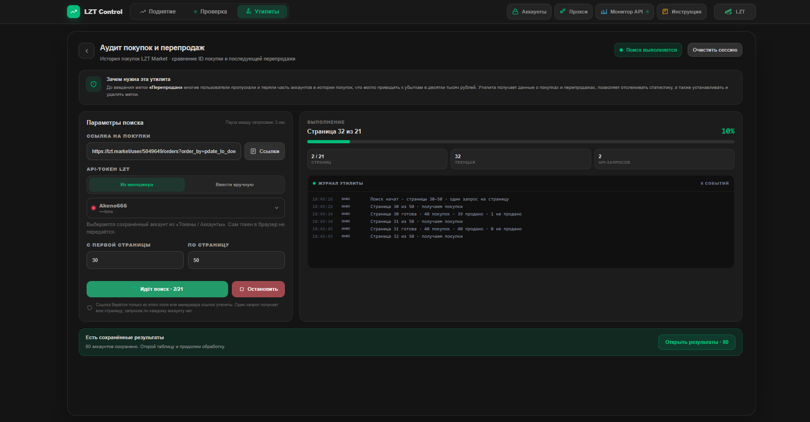
</p>

В таблице собраны ID покупки и перепродажи, даты, цены, статус и рассчитанный результат. Доступны фильтры, сортировка, выгрузка данных и массовое добавление меток.

<p align="center">
  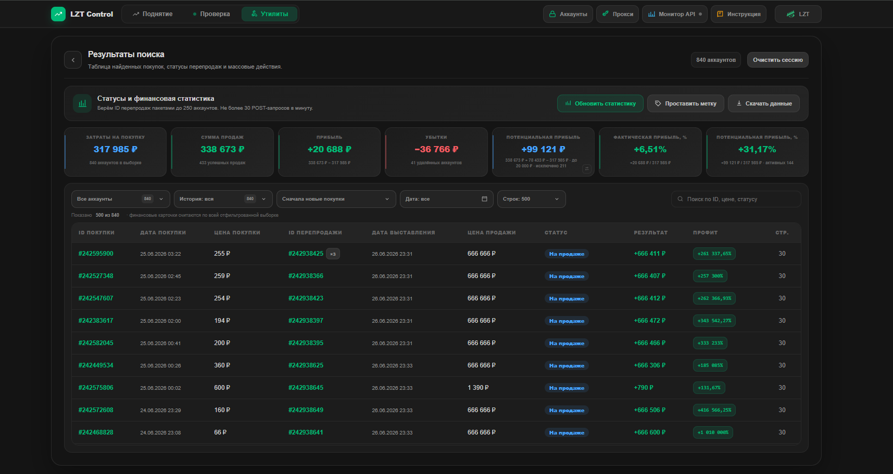
</p>

### Поиск выгодных предложений

Утилита показывает, сколько аккаунт находится на продаже, и сравнивает два варианта: обычную продажу и быструю продажу скупщику. Итог выводится в рублях и процентах.

<p align="center">
  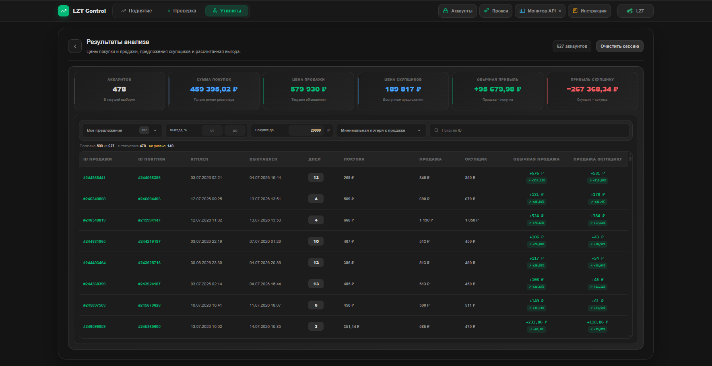
</p>

## Монитор API

Все запросы программы попадают в общий журнал. Для каждой записи указаны раздел, аккаунт, метод, endpoint, время выполнения, HTTP-статус и расход лимита. Ниже показана активность за последний час и состояние лимитов.

<p align="center">
  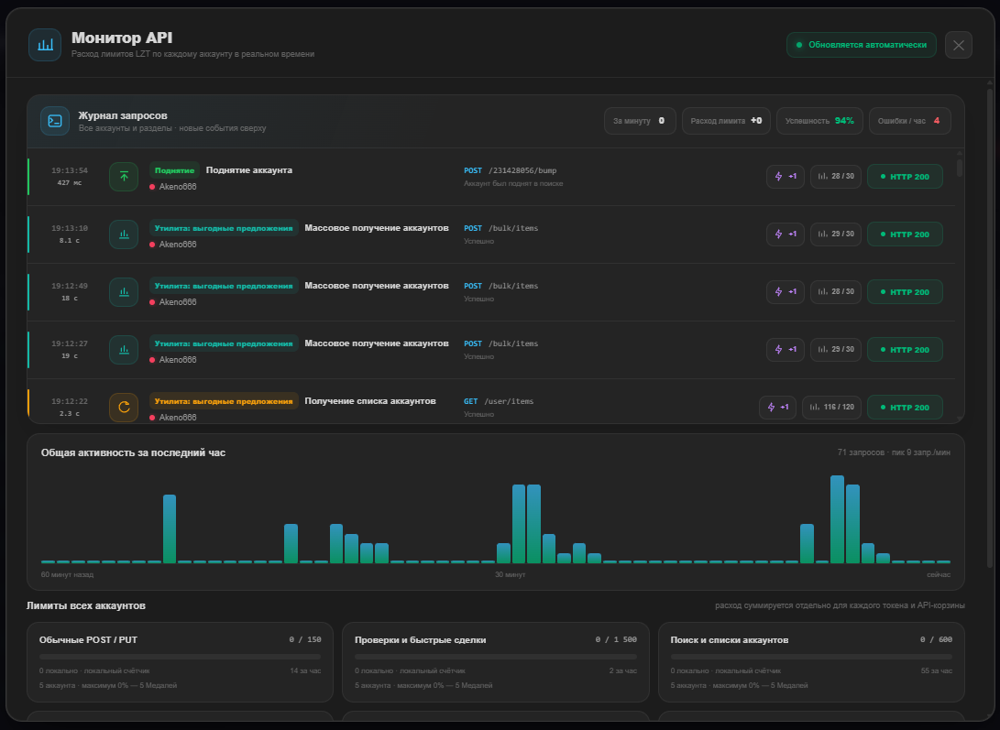
</p>

## Интерактивная инструкция

Встроенная инструкция разбита по страницам и утилитам. Она затемняет фон, выделяет нужный элемент и коротко объясняет его назначение. Инструкция запускается вручную и не меняет настройки.

<table>
  <tr>
    <td width="46%" align="center">
      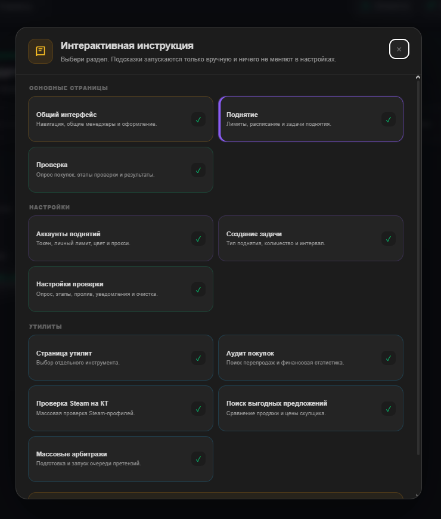<br>
      <sub>Выбор нужного раздела</sub>
    </td>
    <td width="54%" align="center">
      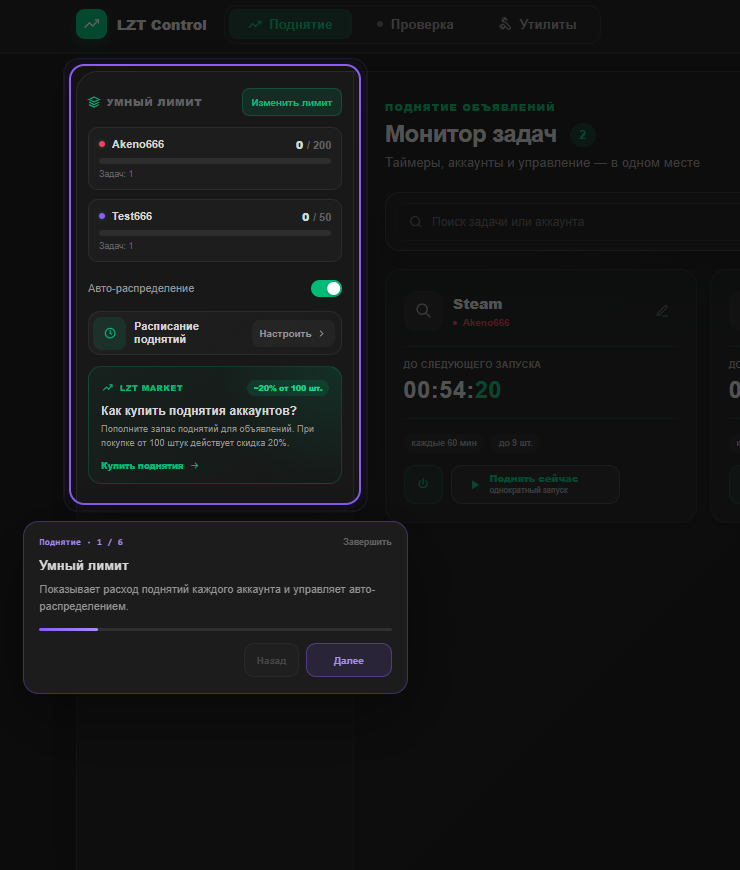<br>
      <sub>Подсветка элемента на странице</sub>
    </td>
  </tr>
</table>

Настройки проверки разбираются внутри открытого окна: инструкция сама переключает вкладки и показывает поля, относящиеся к текущему шагу.

<p align="center">
  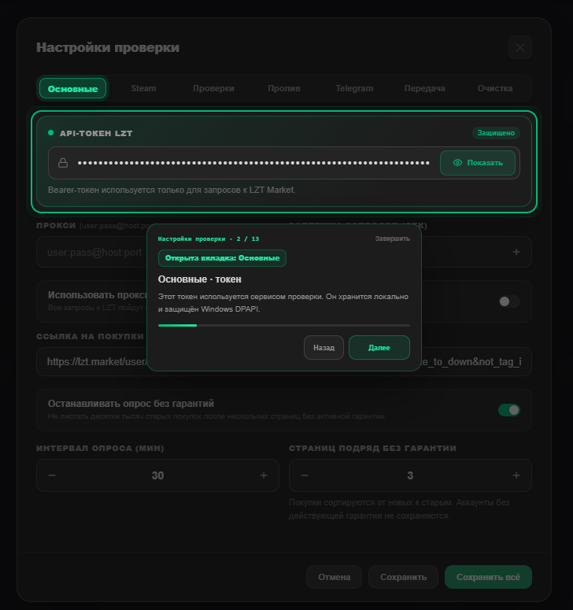
</p>


## Установка и запуск

### Требования

- Windows 10 или Windows 11;
- [Python 3.11 или новее](https://www.python.org/downloads/windows/);
- подключение к интернету;
- API-токен LZT Market.

При установке Python включите пункт `Add Python to PATH`.

### Запуск

1. Нажмите `Code` → `Download ZIP` на странице репозитория.
2. Полностью распакуйте архив в отдельную папку.
3. Запустите `start.bat`.
4. При первом запуске дождитесь установки зависимостей.
5. Панель автоматически откроется по адресу `http://127.0.0.1:8787`.

Первый запуск занимает больше времени: создаётся локальное окружение `.venv` и устанавливаются библиотеки. В дальнейшем используется тот же файл `start.bat`.

Не закрывайте окно LZT Control во время работы — в нём запущен локальный сервер.

## Первая настройка

1. Откройте **«Аккаунты»** в верхней панели.
2. Добавьте API-токен LZT, имя аккаунта и его суточный лимит поднятий.
3. При необходимости выберите прокси.
4. Для проверки покупок откройте **Проверка → Настройки → Основные** и вставьте ссылку на историю покупок.
5. Во вкладке **Проверки** задайте этапы гарантии, например `10`, `55` и `99`.
6. Если нужна публикация после гарантии, заполните вкладку **Пролив**.

Остальные разделы можно настроить позже: Steam API, Telegram-ботов, передачу аккаунтов и очистку локальной базы.

## Данные и безопасность

| Механизм | Как работает |
|---|---|
| **Локальный сервер** | Панель слушает только `127.0.0.1` и не открывается в интернете |
| **Windows DPAPI** | Токены, Steam-ключи, данные Telegram и пароли прокси шифруются средствами Windows |
| **Без телеметрии** | Программа не отправляет пользовательские данные разработчику |
| **Локальная база** | Настройки, журналы и результаты утилит остаются на компьютере пользователя |
| **Монитор запросов** | В интерфейсе видны источник, результат и расход лимита каждого обращения |

Сетевые запросы выполняются только к сервисам, которые нужны выбранным функциям: LZT Market, Steam и Telegram.

> [!WARNING]
> Не передавайте другим людям свою рабочую папку после добавления токенов и аккаунтов. Для установки на другом компьютере скачайте чистую копию репозитория.

## Структура проекта

```text
LZT-Control/
├── app.py              # локальный сервер и API панели
├── arb.py              # фоновые службы проверки
├── services/           # запросы, лимиты и защита данных
├── autoarb/            # проверки, гарантии, публикация и арбитражи
├── utilities/          # отдельные утилиты
├── tutorial/           # интерактивная инструкция
├── static/             # интерфейс
├── start.bat           # запуск программы
└── setup.bat           # установка окружения
```

<details>
<summary><strong>Если программа не запускается</strong></summary>

- Убедитесь, что Python установлен и доступен в системе.
- Проверьте интернет: при первом запуске загружаются зависимости.
- Если браузер не открылся автоматически, перейдите на `http://127.0.0.1:8787` вручную.
- Если порт `8787` занят, закройте ранее запущенное окно LZT Control и повторите запуск.
- Если окружение повреждено, удалите папку `.venv` и снова запустите `start.bat`.

</details>

<details>
<summary><strong>Как остановить программу</strong></summary>

Закройте окно консоли LZT Control или нажмите в нём `Ctrl+C`.

</details>

## Лицензия

Проект распространяется по лицензии [MIT](LICENSE).
